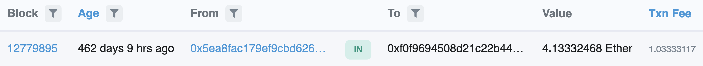

Theft report: Behind the scene of a ether theft by stolen key
===

In this report, I want to document my recent incident where I lost $5$ Ether. My purpose is to raise awareness and show how quickly damage can be caused if you accidentally leak your Ethereum account keys (secret keys) to the public.

Here goes my story: I usually use this Ethereum account (starting with $5ea8$) for test purposes. I sent transactions on Ropsten using the corresponding secret key (starting with $A175$) to test various Ethereum projects like this one. I hardcoded the secret key in the project and pushed it to this GitHub repository for convenience access (on 10/11/2020). Since the account is intended for use in testnets, for a long time (over 10 months), this practice of disclosing the secret key did not cause me trouble. 

On 07/07/2021, I received an email from a reputable company, say ABC company (name marked). ABC wanted to acknowledge my prior technical work by rewarding me 5 Ether. I made a mistake by telling ABC my test account $5ea8$, and I forgot the fact that the secret key of this account is stored in this GitHub repository.

After that, ABC first sent me 0.01 Ether and requested me to acknowledge the receipt of it. I did. 

- Transaction $tx0$ depositing 0.01 Ether to me is here: https://etherscan.io/tx/0xa305288efb5257d7f3cbbe98706807ba17b3ce5ef86b58ecf2e798e674d6f967 

Then, ABC sent me 5 Ether in another Ethereum transaction. 

- Transaction $tx1$  depositing 5 Ether to me is here: https://etherscan.io/tx/0xa002c0a5314e8877f0d9c2d3172ccd963a659b8da3e47cf47caa796211f58800 

Here comes the surprise: Right after $tx1$, another transaction $tx2$ is sent from "my" account ( $5ea8$ ) and transfers the 5 Ether to another account ($f0f9$) that I don’t know. 

- Transaction $tx2$ withdrawing 5 Ether from me to another unknown account ( $f0f9$ ) is here: https://etherscan.io/tx/0xe1a07536f18b0a667f3e2a900f48e6d23edd0f7108240ffa85a5179033634dfe 
- This is the screenshot of this theft transaction

Clearly, I did not send $tx2$. It took me a while to figure out what’s going on:

Whoever holds account $f0f9$ is a thief. He must actively monitor public GitHub pages like this repository and looks for leaked secret keys. He must already know my leaked key long before the incident (leaked on 10/11/2020). But he did not do anything and waited until the 5-Ether deposit. 

After this incident, I immediately stopped using this test account on both mainnet and testnets. So until today, there are only three mainnet transactions related to my leaked account ( $52ea$ ).

- 3-transaction history on mainnet related to my leaked account: https://etherscan.io/address/0x5ea8FaC179ef9cbD626BBef21248CD1EFbFd33dB 

As I checked on 10/12/2022, the stolen 5 Ether is still held in the thief's account $f0f9$. The thief only sends one transaction to this day.

- 1-transaction history on mainnet related to thief account: https://etherscan.io/address/0xf0f9694508d21c22b44d6a470f0404b1d400ef67 
- The full string of the thief account: $0xf0f9694508d21c22b44d6a470f0404b1d400ef67$
